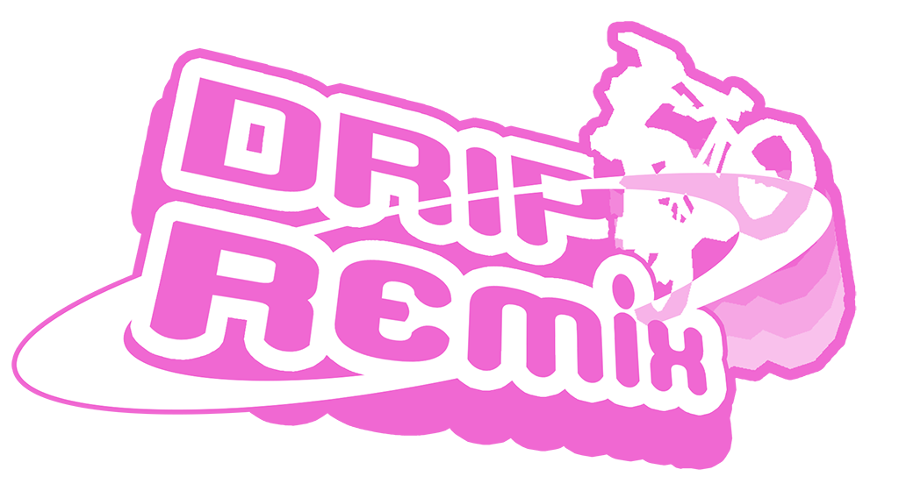
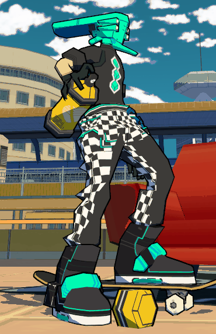
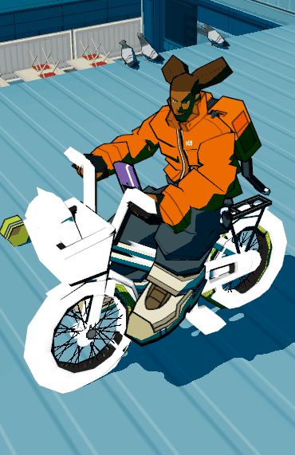
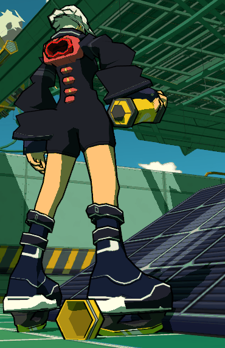
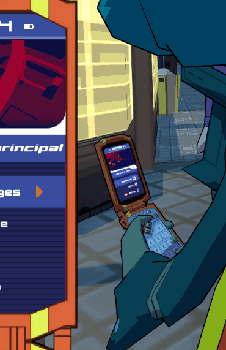

### Swap Skins and Models for your Character, Gears, Phone & Spraycan directly in-game ! (No Unity required)

- *`Unlimited Skins Swap per Character` → Character models can't be swap for now ! Sorry !*
- *`Unlimited Skins/Models Swap for Movestyles/Gears, Phone and Spraycan`*
- *`Custom Color Spray` → Takes bottom left pixel from the texture*
- *`Advance Texture Options` → Emission maps for everything and Phone UI*
- *`Quick Reload In-game`*
- *`Easy Skins/Models Installation & Edit` → Drop .obj and .png/.jpg inside a folder, **no Unity required !***
- *`Custom Binding`*
- *`Save System per Character` → Skin/Model of Character, Gears, Phone and Spraycan*

# HOW TO INSTALL / HOW TO USE

Check the [**Thunderstore Page**](https://lethal-league-blaze.thunderstore.io/c/bomb-rush-cyberfunk/p/AndyLobjois/DripRemix/) for more informations ★

# HOW TO MAKE YOUR OWN SKINS/MODELS

- No Unity required ! Dig it !
- Download [**Models.zip**](https://github.com/AndyLobjois/BRC-DripRemix/blob/main/RESOURCES/Models.zip)
- Edit the `.blend` of your choice
- Duplicate a folder from your `ModdingFolder` as a template (I recommand my [**Examples.zip**](https://github.com/AndyLobjois/BRC-DripRemix/blob/main/RESOURCES/Examples.zip))
- Export each **parts** in `.obj` format and overwrite the corresponding files **(Don't rename it !)**
   - Export settings:
      - `Selected Only : True`
      - `Forward Axis : +Z`
- Remove the `.mtl` files
- Edit the `info.txt` and put the **name/author**
- Edit/Add as many textures as you want (You can rename them for giving a specific order)
- It's done ! You can launch the game and see from your own eyes !
   - Don't forget you can **reload** your mod by pressing `F5` without exiting the game !

# CREDITS

- **Andy Hellgrim** — Code & Design
- **Glomzubuk** — Code Structure & Save/Binding System

*Thanks LMR_1 for the previous logo !*

# CHANGELOG
- [0.1.0] Gears Swapping (MeshRemix was the old name of the tool)
- [1.0.0] Character Skins, Gears Skins/Models, Phone Skins/Models (with UI), Spraycan Skins/Models (with Color Spray)
- [1.0.1] Fix Missing Folders error, Fix PhoneClosed that doesn't show up, Color Spray added to GraffitiGame
- [1.0.2] Fix Felix missing SkinnedMeshRenderer reference
- [1.0.3] Fix Custom Char. Compatibility, Save System Fixed, Missing refs handlers (logError), Phone "rotation" fixed, New Shortcut for Spraycan (E)