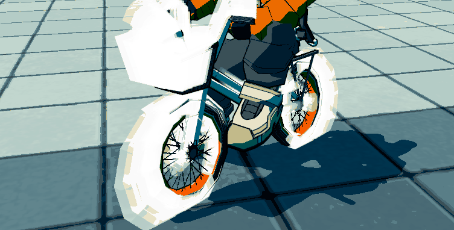
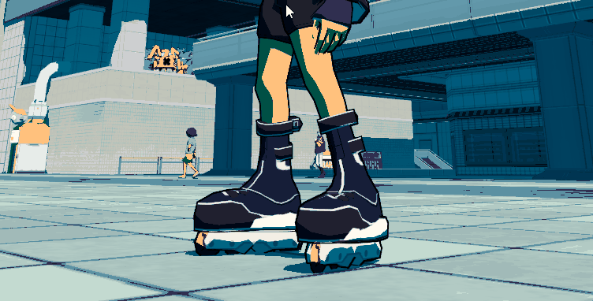
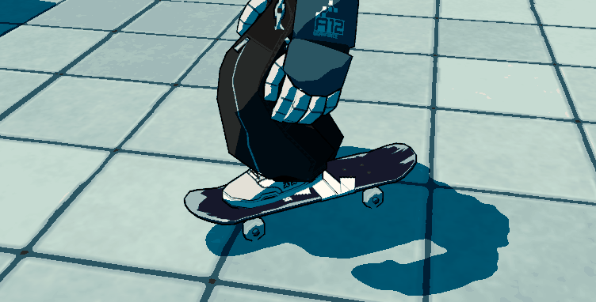
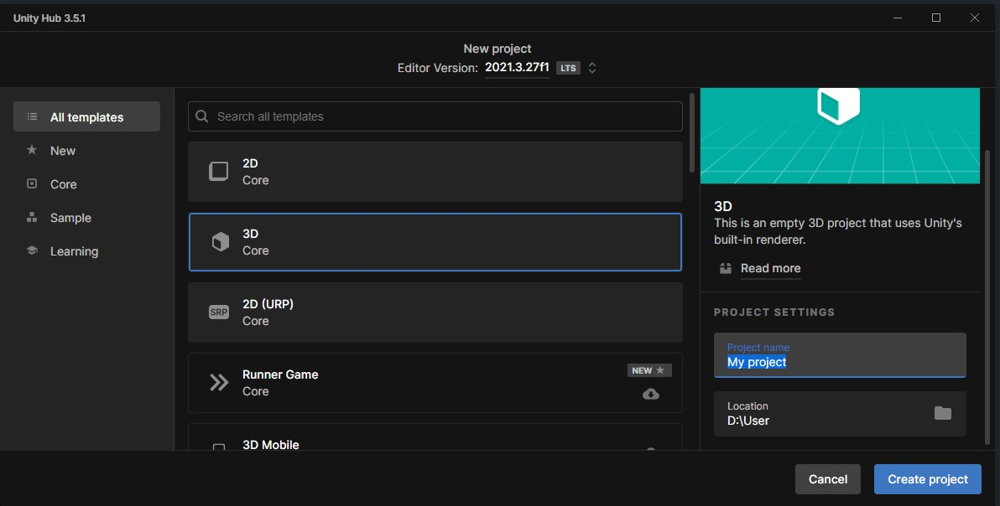
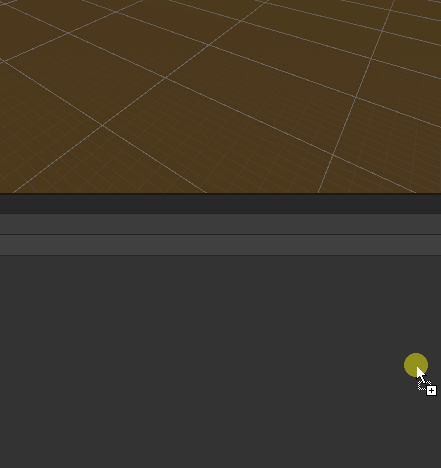
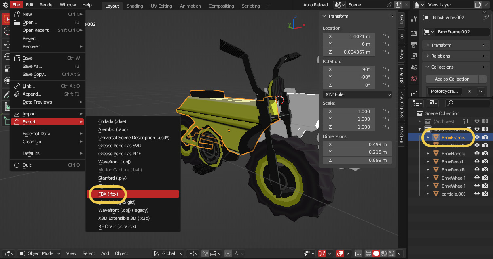
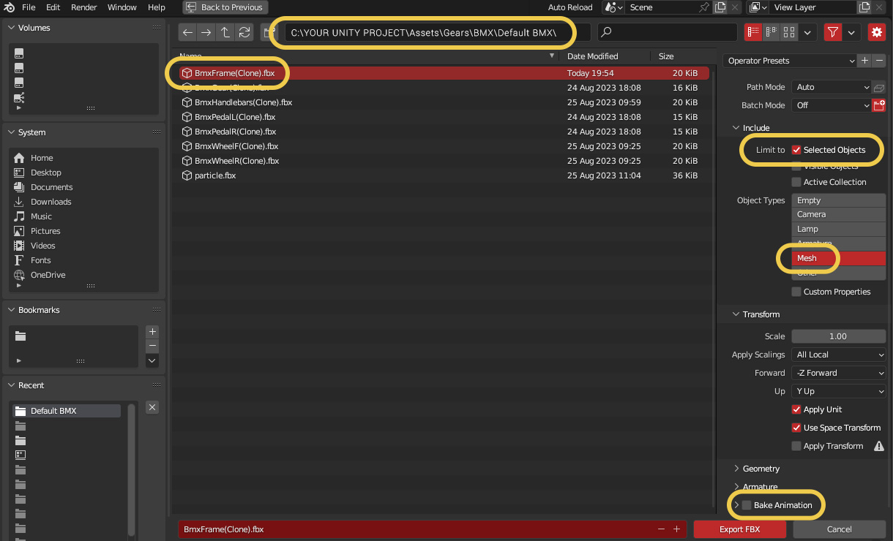
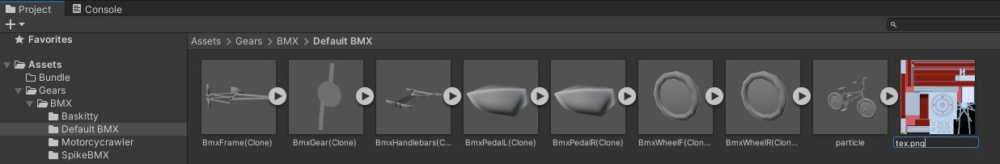
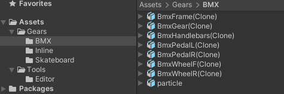
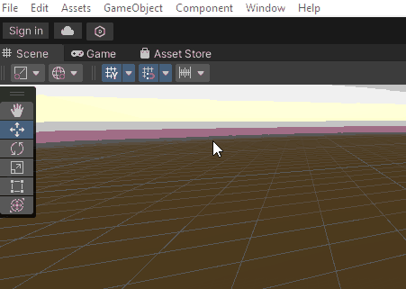

# BRC-MeshRemix

*Load multiple custom models and switch inlines/skateboard/BMX directly in-game just by pressing PageUp/PageDown !*

  

# HOW TO INSTALL

### R2ModManager

- Install [**R2ModManager**](https://lethal-league-blaze.thunderstore.io/package/ebkr/r2modman/) and download [**BRC-MeshRemix**](https://lethal-league-blaze.thunderstore.io/c/bomb-rush-cyberfunk/p/AndyLobjois/MeshRemix/) with the dependencies.
- Launch the game at least once for auto-configuration

### Manually

- Install [**BepInEx**](https://docs.bepinex.dev/articles/user_guide/installation/index.html)
- Download [**BRC-MeshRemix**](https://lethal-league-blaze.thunderstore.io/c/bomb-rush-cyberfunk/p/AndyLobjois/MeshRemix/) (”Manual Download” button) from Thunderstore
- Unzip **BRC-MeshRemix.zip** into the **BepInEx Plugins folder**
- Launch the game at least once for auto-configuration

# HOW TO USE / ADD A CUSTOM GEAR

- Download [**Examples.zip**](RESOURCES/Examples.zip) if you want to test those
- Access your BombRushCyberfunk application folder: `.../BombRushCyberfunk/ModdingFolder/BRC-MeshRemix/Gears/`
- Open the **Examples.zip** and drop some bundles into **corresponding folders**
- Launch the game, all the bundles will be loaded
- In game, enable your movestyle and press **PageUp / PageDown** of your keyboard for scrolling through your bundles !

# HOW TO CREATE BUNDLES

### 1. Create a **New Project** with [**Unity 2021.3.27f**](https://unity.com/releases/editor/whats-new/2021.3.27)

### 2. Drop [**MeshRemix.unitypackage**](RESOURCES/MeshRemix.unitypackage) into **Unity** and import all assets from the package

### 3. Open **Default Gears.blend** from [**Models.zip**](RESOURCES/Models.zip) and make your edits (for non-Blender users, there is .fbx files inside the archive)

> • Make sure to have only **1 material** (except the BMX wheels)
> 
> • Make sure to have only **1 UV map** named **UV0**
> 
> • **Shade Smooth** the whole object (3D View > Object > Shade Smooth), it will prevent the **Outlines to "break" at the corners**
> 
> • **Don't change the Rotation or Scale** of the object, every changes need to happen **inside** the object (Edit Mode)

### 4. **Export each edited mesh (FBX)** inside the Unity project, **over the corresponding FBX files**

⚠️ <b>PLEASE DON'T RENAME THE FBX FILES</b> ! ⚠️

### 5. If you have a **texture**, put the texture aside the mesh(s) and name it `tex.png`

### 6. **Assign a new AssetBundle "Tag"** to all your assets

> It's **important** to make a **Unique AssetBundle Name Tag** because it will reduce the chances someone else put the same ! (Conflict !)
>
> Add the "format" for organization purpose (.inline/ .skateboard / .bmx)

<b><i>Example: “mycustombmx_andyhellgrim.bmx”</i></b>

### 7. **Build** the bundle(s) with **File > Build AssetBundles**

Congratulation, you have your bundle(s) !

# CREDITS

Thanks Glomzubuk for code help !

Thanks LMR_1 for the icon !