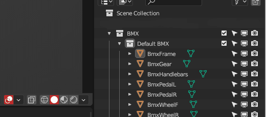

# BRC-MeshRemix

*Load multiple custom models and switch inlines/skateboard/BMX directly in-game just by pressing PageUp/PageDown !*

  

# HOW TO INSTALL

### R2ModManager

- Install [**R2ModManager**](https://lethal-league-blaze.thunderstore.io/package/ebkr/r2modman/) and download [**BRC-MeshRemix**](https://lethal-league-blaze.thunderstore.io/c/bomb-rush-cyberfunk/p/AndyLobjois/MeshRemix/) with the dependencies.
- Launch the game at least once for auto-configuration

### Manually

- Install [**BepInEx**](https://docs.bepinex.dev/articles/user_guide/installation/index.html)
- Download [**BRC-MeshRemix**](https://lethal-league-blaze.thunderstore.io/c/bomb-rush-cyberfunk/p/AndyLobjois/MeshRemix/) (”Manual Download” button) from Thunderstore
- Unzip **BRC-MeshRemix.zip** into the **BepInEx Plugins folder**
- Launch the game at least once for auto-configuration

# HOW TO USE

- When you are in game, enable your movestyle and press **PageUp / PageDown** of your keyboard for scrolling through your bundles

# HOW TO ADD BUNDLES

- Download [**Examples.zip**](RESOURCES/Examples.zip)
- Access to your BombRushCyberfunk application folder: `.../BombRushCyberfunk/ModdingFolder/BRC-MeshRemix/Gears/`
- Open the **Examples.zip** and drop some bundles into **corresponding folders**
- Launch the game, all the bundles will be loaded

# HOW TO CREATE BUNDLES

- Create a **New Project** with [**Unity 2021.3.27f**](https://unity.com/releases/editor/whats-new/2021.3.27)
- Drop [**MeshRemix.unitypackage**](RESOURCES/MeshRemix.unitypackage) into **Unity** and import all assets from the package

- Open **Default Gears.blend** from [**Models.zip**](RESOURCES/Models.zip) and make your edits (for non-Blender users, there is .fbx files inside the archive)
- **Export each edited mesh** inside the Unity project, **over the corresponding FBX files** (keep the names untouched)

- If you have a **texture**, put the texture aside the mesh(s) and name it `tex.png`
- **Rename** the **bundle name** of every assets
    - Suggestion: Put your nickname in the name like this *“mycustombmx_andyhellgrim.bmx”*, it will kinda avoid same-name conflict
    - You can add the .inline/ .skateboard / .bmx at the end of the bundle, it’s just for organization purpose

- **Build** the bundle(s) with **File > Build AssetBundles**. Congratulation, you have your bundle(s) !

